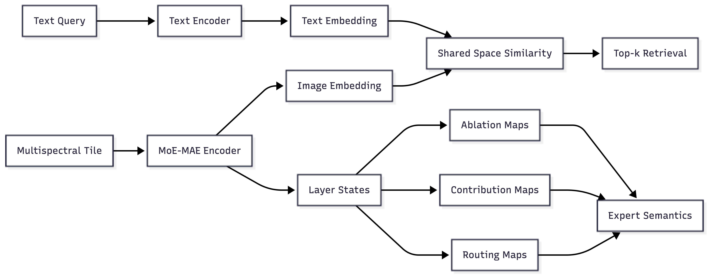
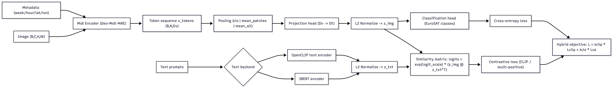
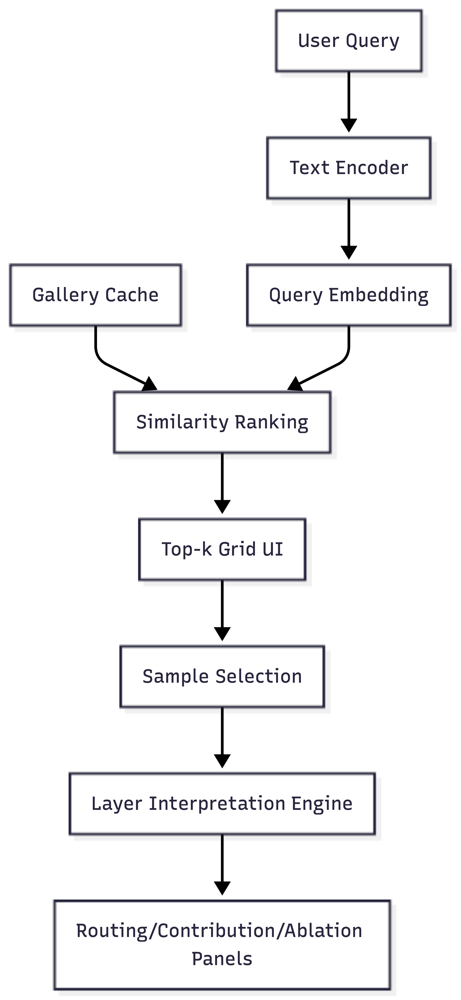

# Geo-MoE-MAE

## Lightweight Vision-Language Mixture-of-Experts for Interpretable Multispectral Satellite Representation Learning

- Audience: challenge participants
- Format: theory + code walkthrough + experiments + bonus app
- Goal: build a compact EO model that is language searchable and expert interpretable

---

# Agenda

1. Challenge overview and expected outputs
2. MoE-MAE internals and reconstruction learning
3. Vision-language alignment and training protocol
4. Retrieval experiments and evaluation
5. Expert interpretability (routing, contribution, ablation, naming)
6. Bonus: retrieval app productization

---

# Challenge Statement

Build a lightweight Earth Observation pipeline that simultaneously provides:

- Strong semantic retrieval from natural language
- Compact compute footprint
- Expert level interpretability with causal evidence

Success requires combining representation quality and explanation quality

---

# What Participants Receive

- Pretrained MoE-MAE vision backbone weights
- EO dataset assets (EuroSAT-L and optional BEN-L sample)
- Text encoder backend (SBERT or OpenCLIP)

What is intentionally missing:

- The final trained image-text alignment bridge for this challenge

---

# What Participants Must Build

1. Image embedding extraction from MoE encoder tokens
2. Projection from vision embedding space to text space
3. Trainable temperature scaling for similarity logits
4. Contrastive training loop for image-text alignment
5. Experimental evidence for expert specialization

---

# Expected Deliverables

- Trained checkpoint (`*_best.pt`) with config and class names
- Retrieval outputs and ranked examples
- Expert analysis outputs (routing, contribution, ablation)
- Expert naming JSON report
- Optional: interactive retrieval + interpretation app

---

# End-to-End Pipeline



---

# Why This Architecture

- EO imagery has high intra-class variance and multi-label semantics
- Compact MoE can specialize while controlling parameter budget
- Contrastive alignment enables open text retrieval
- Causal ablation strengthens interpretability claims beyond correlation

---

# Learning Outcomes for Participants

By the end, participants should be able to:

- Explain and implement sparse MoE routing
- Train a stable VLM head on top of frozen backbones
- Evaluate retrieval with class-aware diagnostics
- Generate and interpret expert attribution evidence
- Deploy a usable retrieval app from the same model stack

---

# Part I

## MoE-MAE Backbone

---


---

# File Map for Part I

Primary files:

- `models/moe_mae.py`
- `datasets/bigearthnet.py`
- `transformation/transformer.py`

---

# EO Input Representation

For each tile:

- Image tensor: $x \in \mathbb{R}^{C \times H \times W}$, with $C=7$ Landsat bands
- Metadata (sin/cos encoded):
  - week, hour, latitude, longitude

Metadata is projected into token space and prepended to patch tokens

---

# Patchification and Token Construction

Patch projection:

$$
p = \text{Conv2D}_{\text{patch}}(x) \in \mathbb{R}^{N_p \times d}
$$

Metadata tokens:

$$
m_{week}, m_{hour}, m_{lat}, m_{lon} \in \mathbb{R}^{d}
$$

Sequence:

$$
X_0 = [m_{week}, m_{hour}, m_{lat}, m_{lon}, cls, p_1, ..., p_{N_p}] + P
$$

where $P$ is positional embedding

---

# Encoder Block Structure

Each block in `MoETransformerEncoderLayer`:

1. LayerNorm + Grouped Query Attention
2. Residual add
3. LayerNorm + MoE FFN
4. Residual add

Formally:

$$
\tilde{X} = X + \text{Attn}(\text{LN}(X))
$$

$$
X' = \tilde{X} + \text{MoE}(\text{LN}(\tilde{X}))
$$
---

# Grouped Query Attention (GQA)

In `GroupedQueryAttention`:

- Queries use full number of heads
- Keys/values are grouped and expanded
- Reduces KV overhead while keeping strong expressivity

Core attention equation:

$$
\text{Attn}(Q,K,V) = \text{softmax}\left(\frac{QK^T}{\sqrt{d_h}}\right)V
$$
---

# Expert MLP: SwiGLU

`SwiGLU` expert output:

$$
\text{SwiGLU}(h)=W_2\left(\text{SiLU}(W h) \odot V h\right)
$$

Implementation note:

- Optionally shares $V$ and $W_2$ across experts (`share_V_W2=True`) to reduce parameters.

---

# Noisy Top-k Gate

For each token feature $h$:

$$
\ell = W_g h
$$

$$
\sigma = \text{softplus}(W_{noise} h)
$$

$$
H = \ell + \epsilon \odot \sigma,\quad \epsilon \sim \mathcal{N}(0, I)
$$

Select top-k indices from $H$, then sparse softmax over selected experts

---

# Sparse Routing Weights

Given top-k expert set $T(h)$:

$$
g_e(h)=
\begin{cases}
\frac{\exp(H_e)}{\sum_{j\in T(h)}\exp(H_j)} & e\in T(h)\\
0 & \text{otherwise}
\end{cases}
$$

Token output:

$$
\text{MoE}(h)=\sum_e g_e(h) f_e(h)
$$
---

# Load and Importance Regularization

In `MoELayer` the code computes two balancing terms via coefficient of variation (CV):

- Importance balance from gate sums
- Load balance from probabilistic assignment estimates

Combined MoE aux loss:

$$
L_{moe}=\lambda_{imp}\,CV(importance)+\lambda_{load}\,CV(load)
$$

This discourages expert collapse

---

# MoE Forward Pass Pseudocode

```python
# models/moe_mae.py (conceptual)
flat = x.reshape(B*N, C)
gates, H, topk_idx, noise_scale, logits = gate(flat)

out = zeros_like(flat)
for e in experts:
    mask = token_uses_expert(topk_idx, e)
    y_e = expert_e(flat[mask])
    out[mask] += y_e * gates[mask, e]

y = out.reshape(B, N, C)
return y, L_moe
```

---

# MAE Wrapper (`MOEMAE`)

Role:

- Randomly mask patch tokens
- Run encoder on visible patches + metadata + cls
- Decode to reconstruct all patches

Random masking keeps only $(1-r)$ of patches where $r$ is mask ratio

---

# Masking and Reconstruction Equations

Patch tokens $p \in \mathbb{R}^{N_p \times d}$.

Sample shuffle permutation and keep set $K$:

$$
|K| = \lfloor (1-r)N_p \rfloor
$$

Predict reconstructed patch vectors $\hat{u}_i$ for all patches.

Target patches $u_i$ come from unfolding original image

---

# Evaluation Loss in Repo (`eval/evaluate_mae.py`)

The evaluator computes:

$$
L_{masked}=\frac{\sum_i m_i\|\hat{u}_i-u_i\|_2^2}{\sum_i m_i}
$$

$$
L_{unmasked}=\frac{\sum_i (1-m_i)\|\hat{u}_i-u_i\|_2^2}{\sum_i (1-m_i)}
$$

$$
L_{total}=L_{masked}+\alpha L_{unmasked}+\beta L_{moe}
$$

---

# Model Size Presets

`build_model(size=...)`:

- `S`: deeper, stronger default for challenge
- `XS`: medium
- `XXS`: smallest

All preserve the same design language with different depth/embed/head configs

---

# Code Snippet: Build Encoder and MAE

```python
# scripts/train_vlm_eurosat_hybrid.py
encoder = build_model(size="S", img_size=40, patch_size=4, in_chans=7)
moe = MOEMAE(encoder).to(device)
moe = load_model(moe, moe_ckpt, device)
encoder = moe.encoder
```

Teaching point:

- VLM training reuses the pretrained encoder from this MAE backbone.

---

# Data Path Assumptions

EuroSAT-L loader (`datasets/eurosat.py`):

- Root layout: `<root>/<ClassName>/<image files>`
- Split file can contain `basename` or `ClassName/basename`
- 7-band image loaded with rasterio and transformed to tensor

---

# Metadata in Datasets

- BigEarthNet loader extracts week/hour from ID and lat/lon from georeference
- EuroSAT-L pipeline in this repo uses zero metadata placeholders for alignment scripts

Instructor note:

- This is a good discussion point about transfer and metadata availability.

---

# Common Failure Modes (Part I)

- Expert collapse: most tokens routed to few experts
- Unstable gating noise early in training
- Mismatch between patch grid and visualization assumptions
- Inconsistent normalization across train and eval transforms

---

# Part II

## Vision-Language Model (VLM) Alignment

---

# File Map for Part II

Primary files:

- `models/vlm.py`
- `scripts/train_vlm_eurosat_hybrid.py`
- `scripts/retrieve_eurosat_text.py`

---



----

# VLM Objective

Map image and text into one normalized space:

$$
z_{img}=\frac{P_v(\text{pool}(X_L))}{\|P_v(\text{pool}(X_L))\|_2}
$$

$$
z_{txt}=\frac{T(q)}{\|T(q)\|_2}
$$

Similarity logits:

$$
S_{ij}=\tau \cdot z^{(i)}_{img} \cdot z^{(j)}_{txt},\quad \tau=\exp(s)
$$

where $s$ is trainable `logit_scale`

---

# Pooling Choices in Code

`pool_image_embedding(...)` supports:

- `cls`: CLS token after metadata tokens
- `mean_patches`: average only patch tokens
- `mean_all`: average all tokens

Recommendation for challenge baseline:

- Start with `cls` for consistency and simplicity.

---

# Text Backends

`GeoMoEMAETextAlign` supports:

- `sbert` backend via SentenceTransformers
- `openclip` backend via OpenCLIP text tower

Both produce normalized text embeddings in a common training interface

---

# Contrastive Loss (Standard CLIP)

Given logits matrix $S \in \mathbb{R}^{B\times B}$:

$$
L_{i\to t} = \frac{1}{B}\sum_i CE(S_{i,:}, i)
$$

$$
L_{t\to i} = \frac{1}{B}\sum_j CE(S_{:,j}, j)
$$

$$
L_{clip}=\frac{1}{2}(L_{i\to t}+L_{t\to i})
$$
---

# Multi-positive Contrastive Loss in Repo

`clip_multilabel_loss(logits, pos_mask)` uses log-sum-exp over positives:

For each row:

$$
L_i = \log\sum_j e^{S_{ij}} - \log\sum_{j\in P(i)} e^{S_{ij}}
$$

Symmetrized over image->text and text->image.

Benefit:

- Handles batches where multiple samples share a class.

---

# Hybrid Training Objective

In `train_vlm_eurosat_hybrid.py`:

$$
L = \lambda_{clip}L_{clip\_multilabel} + \lambda_{cls}L_{CE}
$$

Where:

- $L_{CE}$ is single-label classification loss for EuroSAT class
- $\lambda_{clip}$ and $\lambda_{cls}$ are user-controlled

---

# Why Hybrid Loss

- Contrastive only: may blur class boundaries
- CE only: does not enforce image-text alignment geometry
- Hybrid: supports both retrieval semantics and class discrimination

---

# Prompt Construction from Labels

Class label text is normalized into template prompts, for example:

`"a multispectral satellite image showing {}"`

This creates paired image-text training supervision without manual captions

---

# Freeze Strategy (Recommended)

Phase A baseline:

- Freeze vision encoder
- Freeze text encoder
- Train projection head + temperature + classification head

Phase B optional:

- Unfreeze last N encoder layers with smaller LR (`encoder_lr`)

---

# Data and Batch Semantics

Training batch in script:

- `imgs`: multispectral image tensor
- `labels`: EuroSAT class index
- `prompts`: generated text from class labels
- `meta`: zeros for week/hour/lat/lon in EuroSAT path

---

# Train Loop Anatomy

Inside each step:

1. Build prompts from labels
2. Compute similarity logits and class logits
3. Build positive mask from class equality
4. Compute contrastive + CE losses
5. Backprop + clip grad norm
6. Track retrieval-like and classification diagnostics

---

# Retrieval-Like Diagnostics During Training

Script logs:

- `cls_acc`
- `R1_i2t_cls`: image-to-text top1 class consistency
- `R1_t2i_cls`: text-to-image top1 class consistency

These are useful early sanity checks before full test retrieval

---

# Checkpoint Schema

Saved checkpoint includes:

- `model_state`
- `optimizer_state`
- optional `scaler_state` (AMP)
- `class_names`
- full `config`

This enables deterministic model reconstruction in retrieval and naming scripts

---

# Part III

## Retrieval and Interpretability Experiments

---

# Retrieval Experiment Goal

Given free text query $q$:

- Encode query into text embedding
- Rank gallery images by cosine-equivalent dot similarity
- Inspect top-k relevance and failure cases

---

# Retrieval Equation

Gallery embeddings $Z \in \mathbb{R}^{N\times D}$, query embedding $z_q \in \mathbb{R}^{D}$.

Scores:

$$
s = Z z_q
$$

Return top-k indices by descending score

---

# Retrieval Output Interpretation

Analyze not only top-1 but:

- class diversity in top-k
- confusion patterns by query wording
- score margin between relevant and irrelevant results
- brittle phrasing behavior

---

# Interpretability Stack Overview

Three complementary views per layer:

1. Routing assignment map (where tokens go)
2. Contribution map (which expert output magnitude dominates)
3. Ablation map (causal delta when expert removed)

---

# Deterministic Routing for Analysis

`deterministic_routing(model)` temporarily disables gate noise.

Reason:

- Makes routing/contribution/ablation reproducible for the same sample
- Prevents random gate noise from polluting interpretation

---

# Routing Assignment Map

From `routing_assign_and_usage_for_layer(...)`:

- For each patch token, pick top-1 expert id
- Produce patch grid map $A \in \{0,...,E-1\}^{H_p \times W_p}$
- Compute per-expert usage counts

Useful to see spatial expert specialization patterns

---

# Contribution Map

From `get_expert_contributions_for_layer(...)`:

Per token and expert:

$$
c_{t,e}=\|g_{t,e} f_e(h_t)\|_2
$$

Then reshaped into patch maps.

Interpretation:

- High contribution means expert output strongly influences representation locally.

---

# Causal Ablation Map

From `compute_ablation_heatmaps(...)`:

For each expert $e$:

1. Compute normal forward output
2. Remove expert $e$ in target layer
3. Propagate through remaining layers
4. Measure token delta norm

$$
\Delta_e(t)=\|y_t - y_t^{(-e)}\|_2
$$

Patchwise $\Delta_e$ gives causal importance map

---

# Why Ablation Matters

Correlation-only interpretation can be misleading.

Causal ablation tests:

- If expert really matters, removing it should change representation where it was active.
- Agreement between routing, contribution, and ablation is strong evidence of specialization.

---

# Layer Report Utility

`layer_report_simple(...)` in `analysis_utils.py` bundles:

- Usage bars
- Routing overlay
- Contribution heatmaps
- Ablation heatmaps

Good for fast qualitative diagnostics in notebooks and demos

---

# Expert Naming Objective

Assign semantic labels to experts by matching expert prototypes to text prompts.

Concept:

- Compare to query bank embeddings
- Rank prompt similarity

---

# Expert Naming: Routing Labels

The script can name experts using routing weighted class distributions:

$$
p(y|e) \propto \sum_i w_{i,e} \cdot \mathbf{1}[y_i=y]
$$

Name candidates are top classes in $p(y|e)$.

---

# Suggested Interpretation Protocol

For each selected layer:

1. Inspect dominant routing experts
2. Compare top contribution and top ablation experts
3. Check if named semantics match visible tile content
4. Report disagreements explicitly as analysis findings

---

# Part IV

## Bonus Challenge: Build the Retrieval App

---

# Bonus App Goal

Turn the research pipeline into an interactive, usable interface:

- Query by natural language
- Browse top-k matches
- Inspect per-layer expert behavior for a selected sample

This demonstrates engineering maturity beyond experiments

---

# Existing App References

- EuroSAT app:
  `scripts/app_retrieval_eurosat.py`
- BEN-L app:
  `scripts/app_retrieval.py`

Participants can either build from scratch or improve these

---

# App Architecture


<!--  -->

---

# Minimum App Features

1. Checkpoint loading from saved config
2. Gallery embedding cache (disk persisted)
3. Top-k retrieval view with score and class info
4. Query bank dropdown + free text override
5. Class filter
6. Layer selector and expert visualization panel

---

# Caching Strategy

Use cache key from:

- Checkpoint path + file stats
- Split file path

Then store tensor cache `Z`, labels, and indices.

This avoids re-encoding gallery every app refresh

---

# Robustness in App Code

If embedding dimension mismatch occurs:

- Rebuild cache automatically
- Persist corrected cache

This protects against stale cache after checkpoint changes

---

# App UX Suggestions for Participants

- Keep query controls in sidebar
- Use top-k image grid for fast scan
- Let user select one sample for deep interpretability
- Provide tabs for multiple layers
- Show selected expert name if naming JSON is provided

---

# Part V

## Instructor Live Demo Plan

---

# Live Demo Sequence (Recommended)

1. Show model internals via source snippets
2. Run one retrieval query and inspect top-k
3. Open app and inspect one selected sample
4. Show routing vs contribution vs ablation on same layer
5. Show expert naming JSON and overlay names in app

---

# Demo Commands

```bash
# Train (or use provided checkpoint)
python scripts/train_vlm_eurosat_hybrid.py ...

# Retrieval
python scripts/retrieve_eurosat_text.py ...

# Expert naming
python scripts/run_expert_naming_semantic_eurosat.py ...

# App
streamlit run scripts/app_retrieval_eurosat.py -- ...
```

---

# Common Pitfalls to Warn Participants About

- Normalization mismatch between train and eval
- Forgetting to normalize embeddings before similarity
- Misinterpreting noisy gating without deterministic analysis mode
- Over-claiming expert semantics without ablation evidence
- Evaluating retrieval with too narrow query diversity

---

# Suggested Presentation Structure

1. Method summary
2. Training configuration
3. Retrieval results and failure analysis
4. Interpretability results (routing/contribution/ablation)
5. Expert naming results and uncertainty discussion
6. Bonus app screenshots/video (if implemented)

---

# Suggested Figures to Add

1. Routing overlay example on RGB tile
2. Contribution heatmap per expert (single layer)
3. Ablation delta map per expert (single layer)
4. Top-k retrieval grid for 3 different queries
5. Expert naming table with score margins

---

# Appendix A

## Code Anchors

- `NoisyTopKGate`: `models/moe_mae.py`
- `MoELayer.forward`: `models/moe_mae.py`
- `MOEMAE.forward`: `models/moe_mae.py`
- `GeoMoEMAETextAlign`: `models/vlm.py`
- `clip_multilabel_loss`: `models/vlm.py`
- `train(...)`: `scripts/train_vlm_eurosat_hybrid.py`
- retrieval CLI: `scripts/retrieve_eurosat_text.py`
- naming CLI: `scripts/run_expert_naming_semantic_eurosat.py`
- analysis tools: `utils/analysis_utils.py`
